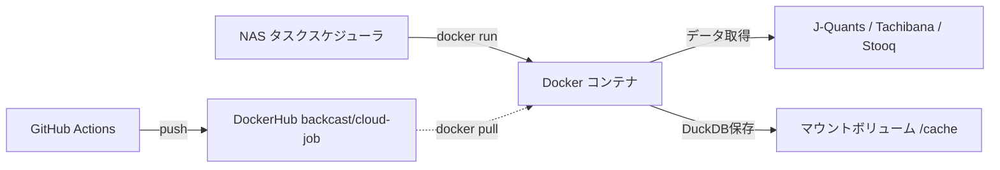

# Docker Jobによる株価データ更新

BackcastProは、夜間にDockerコンテナを使用して株価データを自動更新する仕組みを備えています。
DockerイメージはGitHub Actionsで自動的にDockerHubへpushされ、Synology NASのDockerで定期実行します。

## アーキテクチャ

データの更新プロセスは以下の通りです：

1. GitHub Actionsが `main` ブランチへの push 時に Docker イメージを **DockerHub** (`backcast/cloud-job`) へ push します。
2. Synology NAS のタスクスケジューラが毎晩定刻に **Dockerコンテナ** をトリガーします。
3. コンテナ (`update_stocks_price.py`) が実行されます。
   - J-Quants APIなどから最新の株価データを取得します。
   - 取得したデータをDuckDBファイルとしてマウントされたボリューム（`STOCKDATA_CACHE_DIR`）に直接保存します。



## 構成要素

### Docker イメージ (`backcast/cloud-job`)

- **DockerHub**: `backcast/cloud-job`
- **ソース**: `cloud-job/`
- **Dockerfile**: `cloud-job/Dockerfile`
- **GitHub Action**: `.github/workflows/publish-dockerhub.yml`
- **役割**: データの取得、加工、DuckDBファイルへの保存
- **データ保存先**: 環境変数 `STOCKDATA_CACHE_DIR`（デフォルト: `/cache`）で指定されたディレクトリ

### 必要な環境変数・シークレット

| 環境変数 | 用途 |
|---|---|
| `JQUANTS_API_KEY` | J-Quants API認証 |
| `eAPI_URL` | 立花証券 e-支店 APIエンドポイント |
| `eAPI_USER_ID` | 立花証券 ユーザーID |
| `eAPI_PASSWORD` | 立花証券 パスワード |

## Docker イメージの取得

DockerHub から最新イメージを pull します：

```bash
docker pull backcast/cloud-job:latest
```

### ローカルでビルドする場合

```bash
docker build -f cloud-job/Dockerfile -t backcast/cloud-job .
```

## 実行方法

### 特定銘柄で動作確認

```bash
docker run -v /path/to/duckdb:/cache \
  -e JQUANTS_API_KEY=xxx \
  -e eAPI_URL=xxx \
  -e eAPI_USER_ID=xxx \
  -e eAPI_PASSWORD=xxx \
  backcast/cloud-job --codes 7203 --days 3
```

### 全銘柄を更新

```bash
docker run -v /path/to/duckdb:/cache \
  -e JQUANTS_API_KEY=xxx \
  -e eAPI_URL=xxx \
  -e eAPI_USER_ID=xxx \
  -e eAPI_PASSWORD=xxx \
  backcast/cloud-job --days 7
```

### CLI引数

| 引数 | デフォルト | 説明 |
|---|---|---|
| `--codes` | なし（全銘柄） | 処理対象の銘柄コード（カンマ区切り） |
| `--days` | 7 | 取得する過去日数 |

## 定期実行の設定

### Synology NAS（タスクスケジューラ）

Synology DSM の **コントロールパネル > タスクスケジューラ** で以下のスクリプトを登録してください：

```bash
docker pull backcast/cloud-job:latest
docker run --rm -v /volume1/docker/backcast/cache:/cache \
  -e JQUANTS_API_KEY=xxx \
  -e eAPI_URL=xxx \
  -e eAPI_USER_ID=xxx \
  -e eAPI_PASSWORD=xxx \
  backcast/cloud-job --days 7
```

### cron（Linux/Mac）

```bash
# 毎日 19:30 に実行
30 19 * * 1-5 docker run --rm -v /path/to/duckdb:/cache -e JQUANTS_API_KEY=xxx -e eAPI_URL=xxx -e eAPI_USER_ID=xxx -e eAPI_PASSWORD=xxx backcast/cloud-job --days 7
```

### タスクスケジューラ（Windows）

PowerShellスクリプトを作成し、タスクスケジューラに登録してください。

## 運用・監視

### ログ確認

ログはコンソール（stdout）に出力されます。

```bash
# コンテナのログを確認
docker logs <container_id>
```

### データ確認

更新されたデータは、マウントされたボリューム内のDuckDBファイルを直接確認することで検証できます。

```bash
# ボリューム内のDuckDBファイルを確認
ls /path/to/duckdb/stocks_daily/
# 例: 7203.duckdb, 8306.duckdb, ...
```

## トラブルシューティング

### コンテナがimportエラーで失敗する

Dockerfile の `PYTHONPATH` が `/app/src` に設定されているか確認してください。`trading_data` と `BackcastPro` パッケージは `/app/src/` 配下にコピーされるため、この設定がないと `ModuleNotFoundError` になります。
