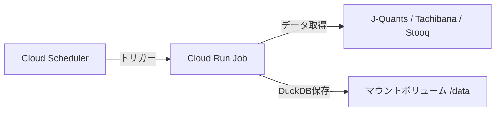

# Cloud Run Jobによる株価データ更新

BackcastProは、夜間にCloud Run Jobを使用して株価データを自動更新する仕組みを備えています。

## アーキテクチャ

データの更新プロセスは以下の通りです：

1. **Cloud Scheduler** が毎晩定刻（例: 19:30 JST）に **Cloud Run Job** をトリガーします。
2. **Cloud Run Job** (`update_stocks_price.py`) が実行されます。
   - J-Quants APIなどから最新の株価データを取得します。
   - 取得したデータをDuckDBファイルとしてマウントされたボリューム（`BACKCASTPRO_CACHE_DIR`）に直接保存します。



## 構成要素

### 1. Cloud Run Job (`update-stocks-price`)

- **ソース**: `cloud-job/`
- **イメージ**: `asia-northeast1-docker.pkg.dev/carbide-booth-486907-a3/cloud-run-source-deploy/update-stocks-price:latest`
- **役割**: データの取得、加工、DuckDBファイルへの保存
- **認証**: Secret ManagerからAPIキーなどを取得
- **データ保存先**: 環境変数 `BACKCASTPRO_CACHE_DIR`（デフォルト: `/data`）で指定されたディレクトリ

## 本番環境情報

| 項目 | 値 |
|------|-----|
| GCP プロジェクト ID | `carbide-booth-486907-a3` |
| プロジェクト番号 | `341714433786` |
| リージョン | `asia-northeast1` |
| Artifact Registry | `asia-northeast1-docker.pkg.dev/carbide-booth-486907-a3/cloud-run-source-deploy/` |
| サービスアカウント | `341714433786-compute@developer.gserviceaccount.com` |

### Secret Manager に登録済みのシークレット

| シークレット名 | 用途 |
|---|---|
| `JQUANTS_API_KEY` | J-Quants API認証 |
| `eAPI_URL` | 立花証券 e-支店 APIエンドポイント |
| `eAPI_USER_ID` | 立花証券 ユーザーID |
| `eAPI_PASSWORD` | 立花証券 パスワード |

## デプロイ手順

### 前提条件

- Google Cloud SDK (`gcloud`) がインストール・設定されていること
- 上記のSecretがSecret Managerに登録されていること
- サービスアカウントに `secretAccessor` ロールが付与されていること

### Cloud Run Job のデプロイ（2ステップ方式）

!!! warning "注意"
    `gcloud run jobs deploy --dockerfile` フラグは**非対応**です。Cloud Build でイメージをビルドしてから Job を更新する 2 ステップ方式を使います。

**ステップ 1: Docker イメージのビルド＆プッシュ**

プロジェクトルートの `cloudbuild-job.yaml` を使用します：

```bash
MSYS_NO_PATHCONV=1 gcloud.cmd builds submit --config=cloudbuild-job.yaml .
```

**ステップ 2: Job の作成または更新**

初回作成：

```bash
MSYS_NO_PATHCONV=1 gcloud.cmd run jobs create update-stocks-price \
  --region=asia-northeast1 \
  --image=asia-northeast1-docker.pkg.dev/carbide-booth-486907-a3/cloud-run-source-deploy/update-stocks-price:latest \
  --task-timeout=3600 \
  --max-retries=1 \
  --memory=2Gi \
  --cpu=1 \
  --set-secrets="JQUANTS_API_KEY=JQUANTS_API_KEY:latest,eAPI_URL=eAPI_URL:latest,eAPI_USER_ID=eAPI_USER_ID:latest,eAPI_PASSWORD=eAPI_PASSWORD:latest" \
  --set-env-vars="BACKCASTPRO_CACHE_DIR=/data"
```

コード変更後の更新：

```bash
MSYS_NO_PATHCONV=1 gcloud.cmd run jobs update update-stocks-price \
  --region=asia-northeast1 \
  --image=asia-northeast1-docker.pkg.dev/carbide-booth-486907-a3/cloud-run-source-deploy/update-stocks-price:latest
```

### Cloud Scheduler の設定

```bash
MSYS_NO_PATHCONV=1 gcloud.cmd scheduler jobs create http update-stocks-price-nightly \
  --location=asia-northeast1 \
  --schedule="30 19 * * 1-5" \
  --time-zone="Asia/Tokyo" \
  --uri="https://asia-northeast1-run.googleapis.com/apis/run.googleapis.com/v1/namespaces/carbide-booth-486907-a3/jobs/update-stocks-price:run" \
  --http-method=POST \
  --oauth-service-account-email=341714433786-compute@developer.gserviceaccount.com
```

## Job の実行・テスト

### 特定銘柄で動作確認

```bash
MSYS_NO_PATHCONV=1 gcloud.cmd run jobs execute update-stocks-price \
  --region=asia-northeast1 \
  --args="--codes,7203,--days,3"
```

### ローカルDockerで動作確認

```bash
docker build -f cloud-job/Dockerfile -t update-stocks-price .
docker run -v /path/to/duckdb:/data \
  -e JQUANTS_API_KEY=xxx \
  -e eAPI_URL=xxx \
  -e eAPI_USER_ID=xxx \
  -e eAPI_PASSWORD=xxx \
  update-stocks-price --codes 7203 --days 3
```

### 実行状態の確認

```bash
# 最新の実行を確認
MSYS_NO_PATHCONV=1 gcloud.cmd run jobs executions list \
  --job=update-stocks-price \
  --region=asia-northeast1

# 特定の実行の詳細
MSYS_NO_PATHCONV=1 gcloud.cmd run jobs executions describe <EXECUTION_NAME> \
  --region=asia-northeast1
```

## 運用・監視

### ログ確認

GCP Console から確認するのが最も簡単です：

1. [Cloud Run Jobs](https://console.cloud.google.com/run/jobs?project=carbide-booth-486907-a3) を開く
2. `update-stocks-price` をクリック
3. 該当の実行を選択してログを確認

コマンドラインで確認する場合は **PowerShell を使用**してください（理由は後述）：

```powershell
gcloud.cmd logging read 'resource.type="cloud_run_job" AND resource.labels.job_name="update-stocks-price"' --limit=50 --format="table(timestamp,textPayload)" --order=desc --project=carbide-booth-486907-a3
```

### データ確認

更新されたデータは、マウントされたボリューム内のDuckDBファイルを直接確認することで検証できます。

```bash
# ボリューム内のDuckDBファイルを確認
ls /path/to/duckdb/stocks_daily/
# 例: 7203.duckdb, 8306.duckdb, ...
```

## Windows (MSYS/Git Bash) 環境での注意事項

!!! danger "重要"
    Windows の bash (MSYS/Git Bash) は特有の問題があります。以下の注意点を必ず守ってください。

### 1. パス自動変換の無効化

MSYS/Git Bash は `/` で始まる文字列を Windows パスに自動変換します。これにより URL やシークレット参照が壊れます。

**すべての gcloud コマンドの先頭に `MSYS_NO_PATHCONV=1` を付けてください。**

```bash
# NG: パスが壊れる
gcloud.cmd run jobs update update-stocks-price --set-env-vars="BACKCASTPRO_CACHE_DIR=/data"

# OK: パス変換を無効化
MSYS_NO_PATHCONV=1 gcloud.cmd run jobs update update-stocks-price --set-env-vars="BACKCASTPRO_CACHE_DIR=/data"
```

### 2. gcloud logging はbashから動作しない

`gcloud.cmd logging read` は、Cloud SDK のインストールパスにスペース（`C:\Users\...\AppData\Local\Google\Cloud SDK\...`）が含まれるため、bash から実行するとエラーになります。

**ログ確認は PowerShell を使うか、GCP Console で行ってください。**

### 3. gcloud.cmd を使う

Windows では `gcloud` ではなく `gcloud.cmd` を使用してください。

## トラブルシューティング

### Job が exit code 1 で即座に失敗する

**症状**: Job 実行後、数秒以内に exit code 1 で失敗し、アプリケーションログ（stdout/stderr）が一切出力されない。

**原因**: Dockerfile で `CMD` を使っている場合、Cloud Run Job の `--args` がコマンド全体を**置換**してしまい、引数（例: `--codes`）を実行ファイルとして実行しようとする。

**解決策**: Dockerfile の `CMD` を `ENTRYPOINT` に変更する。

```dockerfile
# NG: --args がコマンド全体を置換する
CMD ["python", "/app/update_stocks_price.py"]

# OK: --args が引数として追加される
ENTRYPOINT ["python", "/app/update_stocks_price.py"]
```

詳細は [設計判断記録 - DockerfileのENTRYPOINT化](design-decisions.md#dockerfileのentrypoint化) を参照。

### 環境変数が壊れている

MSYS のパス自動変換により、パスが `/data` → `C:\...` のように壊れることがあります。

`gcloud run jobs describe` で環境変数の値を確認し、壊れていた場合は `MSYS_NO_PATHCONV=1` を付けて `gcloud run jobs update` で修正してください。

### ビルドは成功するが import エラーで失敗する

Dockerfile の `PYTHONPATH` が `/app/src` に設定されているか確認してください。`trading_data` と `BackcastPro` パッケージは `/app/src/` 配下にコピーされるため、この設定がないと `ModuleNotFoundError` になります。
