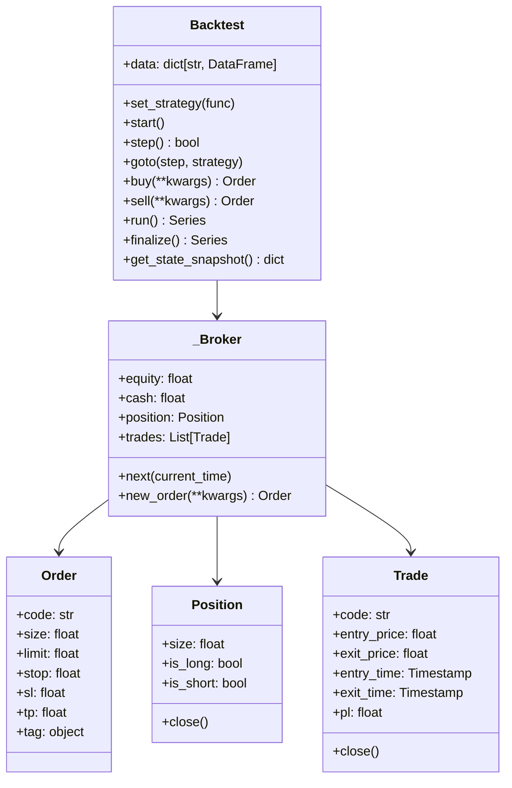

#  開発者向けガイド

BackcastProの開発に参加するためのガイドです。

## 目次

- [開発環境のセットアップ](#開発環境のセットアップ)
- [プロジェクト構造](#プロジェクト構造)
- [アーキテクチャ](#アーキテクチャ)
- [コーディング規約](#コーディング規約)
- [テスト](#テスト)
- [コントリビューション](#コントリビューション)
- [リリースプロセス](#リリースプロセス)

## 開発環境のセットアップ

### 必要なツール

- Python 3.9+
- Git
- pip
- テキストエディタ（VS Code推奨）

### セットアップ手順

1. **リポジトリをクローン**
```powershell
git clone https://github.com/botterYosuke/BackcastPro.git
cd BackcastPro
```

2. **仮想環境を作成**
```powershell
python -m venv .venv
.\.venv\Scripts\Activate.ps1
```

3. **依存関係をインストール**
```powershell
python -m pip install -e .
```

4. **開発用依存関係をインストール**
```powershell
python -m pip install pytest pytest-cov black flake8 mypy
```

### VS Code設定

`.vscode/settings.json`を作成：

```json
{
    "python.defaultInterpreterPath": ".\\.venv\\Scripts\\python.exe",
    "python.linting.enabled": true,
    "python.linting.flake8Enabled": true,
    "python.formatting.provider": "black",
    "python.testing.pytestEnabled": true,
    "python.testing.pytestArgs": ["tests"]
}
```

## プロジェクト構造

```
BackcastPro/
├── src/
│   └── BackcastPro/
│       ├── __init__.py          # メインパッケージ
│       ├── backtest.py          # バックテストエンジン
│       ├── _broker.py           # ブローカー実装
│       ├── _stats.py            # 統計計算
│       ├── order.py             # 注文クラス
│       ├── position.py          # ポジションクラス
│       ├── trade.py             # トレードクラス
│       └── api/                 # データ取得API
│           ├── __init__.py
│           ├── stocks_price.py  # 日足データ取得
│           ├── stocks_board.py  # 板情報取得
│           ├── stocks_info.py   # 銘柄情報取得
│           ├── db_manager.py    # データベース管理
│           ├── db_stocks_daily.py
│           ├── db_stocks_board.py
│           ├── db_stocks_info.py
│           └── ftp_client.py    # FTPクライアント
├── tests/                       # テストファイル
├── docs/                        # ドキュメント
│   └── examples/                # サンプルコード
├── pyproject.toml              # プロジェクト設定
└── README.md                   # プロジェクト説明
```

## アーキテクチャ

### 主要コンポーネント

#### 1. Backtestクラス
- バックテストの実行を管理
- データと戦略関数を統合
- ステップ実行・一括実行をサポート
- 結果の計算と返却

#### 2. 戦略関数（function-based API）
- ユーザーが定義する戦略ロジック
- `def my_strategy(bt): ...` 形式
- `bt.buy()` / `bt.sell()` で売買指示

#### 3. _Brokerクラス
- 注文の実行と管理
- ポジションとトレードの追跡
- 手数料とスプレッドの計算

#### 4. APIモジュール
- 外部APIからのデータ取得
- DuckDBを使ったローカルキャッシュ
- 日本株価・板情報・銘柄情報の取得

### データフロー

```
1. データ取得
   ↓
2. バックテスト初期化 (Backtest.__init__)
   ↓
3. 戦略関数設定 (set_strategy)
   ↓
4. バックテスト開始 (start)
   ↓
5. 各ステップで戦略関数実行 (strategy(bt))
   ↓
6. 1バー進める (step)
   ↓
7. 注文処理 (_Broker.next)
   ↓
8. 統計計算 (finalize)
   ↓
9. 結果返却 (pd.Series)
```

### クラス図



## コーディング規約

### Pythonスタイル

- **PEP 8**に準拠
- **Black**でフォーマット
- **flake8**でリント
- **mypy**で型チェック

### 命名規則

- **クラス名**: PascalCase (例: `Backtest`, `_Broker`)
- **関数名**: snake_case (例: `run`, `compute_stats`)
- **変数名**: snake_case (例: `data`, `step_index`)
- **定数名**: UPPER_SNAKE_CASE (例: `DEFAULT_CASH`)

### ドキュメント

- **docstring**はGoogle形式を使用
- **型ヒント**を必須とする
- **コメント**は日本語で記述

### 例

```python
def calculate_rsi(data: pd.DataFrame, period: int = 14) -> pd.Series:
    """
    RSI（相対力指数）を計算します。

    Args:
        data: OHLCVデータを含むDataFrame
        period: RSIの計算期間（デフォルト: 14）

    Returns:
        RSI値を含むSeries

    Raises:
        ValueError: データが空の場合
    """
    if data.empty:
        raise ValueError("データが空です")

    # RSI計算ロジック
    delta = data['Close'].diff()
    gain = delta.clip(lower=0.0)
    loss = -delta.clip(upper=0.0)

    avg_gain = gain.rolling(period, min_periods=period).mean()
    avg_loss = loss.rolling(period, min_periods=period).mean()

    rs = avg_gain / (avg_loss.replace(0, pd.NA))
    return 100 - (100 / (1 + rs))
```

## テスト

### テスト構造

```
tests/
├── test_backtest_api.py              # バックテストAPIのテスト
├── test_backtest_chart_auto_update.py # チャート自動更新のテスト
├── test_backtest_set_data.py         # データ設定のテスト
├── test_backtest_step_loop.py        # ステップ実行のテスト
├── test_db_stocks_board.py           # 板情報DBのテスト
├── test_db_stocks_daily.py           # 日足DBのテスト
├── test_db_stocks_info.py            # 銘柄情報DBのテスト
├── test_e_api.py                     # 外部APIのテスト
├── test_ftp_client.py                # FTPクライアントのテスト
├── test_indicators.py                # インジケーターのテスト
├── test_j-quants.py                  # J-Quantsのテスト
├── test_stooq.py                     # Stooqのテスト
├── test_relative_size_option_c.py    # 相対サイズオプションのテスト
└── marimo_test_indicators.py         # marimoインジケーターテスト
```

### テストの実行

```powershell
# 全テストを実行
python -m pytest

# カバレッジ付きで実行
python -m pytest --cov=BackcastPro

# 特定のテストを実行
python -m pytest tests/test_backtest_api.py

# 詳細な出力で実行
python -m pytest -v
```

### テストの書き方

```python
import pytest
import pandas as pd
from BackcastPro import Backtest


def test_strategy(bt):
    """テスト用の戦略関数"""
    for code, df in bt.data.items():
        if len(df) == 1 and bt.position_of(code) == 0:
            bt.buy(code=code, tag="test_buy")


def test_backtest_basic():
    """基本的なバックテストのテスト"""
    # テストデータを作成
    data = pd.DataFrame({
        'Open': [100, 101, 102],
        'High': [105, 106, 107],
        'Low': [99, 100, 101],
        'Close': [104, 105, 106],
        'Volume': [1000, 1100, 1200]
    }, index=pd.date_range('2023-01-01', periods=3))

    # バックテストを実行
    bt = Backtest(data={'TEST': data}, cash=10000)
    bt.set_strategy(test_strategy)
    results = bt.run()

    # 結果を検証
    assert results['Return [%]'] >= 0
    assert results['# Trades'] >= 0


def test_step_execution():
    """ステップ実行のテスト"""
    data = pd.DataFrame({
        'Open': [100, 101, 102],
        'High': [105, 106, 107],
        'Low': [99, 100, 101],
        'Close': [104, 105, 106],
        'Volume': [1000, 1100, 1200]
    }, index=pd.date_range('2023-01-01', periods=3))

    bt = Backtest(data={'TEST': data}, cash=10000)

    count = 0
    while not bt.is_finished:
        test_strategy(bt)
        bt.step()
        count += 1

    assert count == 3
    assert bt.is_finished
```

### フィクスチャの使用

```python
@pytest.fixture
def sample_data():
    """サンプルデータのフィクスチャ"""
    return pd.DataFrame({
        'Open': [100, 101, 102, 103, 104],
        'High': [105, 106, 107, 108, 109],
        'Low': [99, 100, 101, 102, 103],
        'Close': [104, 105, 106, 107, 108],
        'Volume': [1000, 1100, 1200, 1300, 1400]
    }, index=pd.date_range('2023-01-01', periods=5))


@pytest.fixture
def simple_strategy():
    """シンプルな戦略関数のフィクスチャ"""
    def strategy(bt):
        for code, df in bt.data.items():
            if len(df) == 1 and bt.position_of(code) == 0:
                bt.buy(code=code)
    return strategy


def test_with_fixtures(sample_data, simple_strategy):
    """フィクスチャを使用したテスト"""
    bt = Backtest(data={'TEST': sample_data}, cash=10000)
    bt.set_strategy(simple_strategy)
    results = bt.run()
    assert results['Return [%]'] >= 0
```

## コントリビューション

### コントリビューションの流れ

1. **Issueを作成** - バグ報告や機能要求
2. **Fork** - リポジトリをフォーク
3. **ブランチ作成** - 機能ブランチを作成
4. **開発** - コードを実装
5. **テスト** - テストを実行
6. **Pull Request** - PRを作成
7. **レビュー** - コードレビューを受ける
8. **マージ** - メインブランチにマージ

### ブランチ命名規則

- `feature/機能名` - 新機能
- `bugfix/バグ名` - バグ修正
- `docs/ドキュメント名` - ドキュメント更新
- `refactor/リファクタリング名` - リファクタリング

### コミットメッセージ

```
<type>(<scope>): <subject>

<body>

<footer>
```

**例:**
```
feat(backtest): プログレスバーを追加

バックテスト実行中にプログレスバーを表示する機能を追加。
tqdmライブラリを使用して実装。

Closes #123
```

### Pull Request

PRを作成する際は以下を含めてください：

1. **変更内容の説明**
2. **テスト結果**
3. **スクリーンショット**（UI変更の場合）
4. **関連Issue**へのリンク

### コードレビュー

レビュー時は以下を確認：

1. **コード品質** - 可読性、保守性
2. **テスト** - テストカバレッジ
3. **ドキュメント** - 更新の必要性
4. **パフォーマンス** - 性能への影響

## リリースプロセス

### バージョン管理

- **セマンティックバージョニング**を使用
- **MAJOR.MINOR.PATCH**形式
- **MAJOR**: 破壊的変更
- **MINOR**: 新機能追加
- **PATCH**: バグ修正

### リリース手順

1. **バージョン更新**
```toml
# pyproject.toml の version を更新
version = "0.4.0"
```

2. **CHANGELOG更新**
```markdown
## [0.4.0] - 2025-01-01

### Added
- 新機能A
- 新機能B

### Changed
- 既存機能の改善

### Fixed
- バグ修正A
- バグ修正B
```

3. **テスト実行**
```powershell
python -m pytest
python -m pytest --cov=BackcastPro
```

4. **ビルド**
```powershell
uv build
```

5. **PyPIにアップロード**
```powershell
uv publish
```

6. **Gitタグ作成**
```powershell
git tag v0.4.0
git push origin v0.4.0
```

### 自動化

GitHub Actionsを使用して以下を自動化：

- **テスト実行** - PR作成時
- **コード品質チェック** - リント、フォーマット
- **ビルド** - リリース時
- **PyPIアップロード** - タグ作成時

## パフォーマンス最適化

### プロファイリング

```python
import cProfile
import pstats
from BackcastPro import Backtest

def profile_backtest():
    """バックテストのプロファイリング"""
    def my_strategy(bt):
        for code, df in bt.data.items():
            if len(df) > 20 and bt.position_of(code) == 0:
                sma = df['Close'].rolling(20).mean().iloc[-1]
                if df['Close'].iloc[-1] < sma:
                    bt.buy(code=code)

    # プロファイリングを開始
    profiler = cProfile.Profile()
    profiler.enable()

    # バックテストを実行
    bt = Backtest(data={'TEST': data}, cash=10000)
    bt.set_strategy(my_strategy)
    results = bt.run()

    # プロファイリングを停止
    profiler.disable()

    # 結果を表示
    stats = pstats.Stats(profiler)
    stats.sort_stats('cumulative')
    stats.print_stats(10)

if __name__ == "__main__":
    profile_backtest()
```

### メモリ使用量の監視

```python
import psutil
import os

def monitor_memory():
    """メモリ使用量を監視"""
    def my_strategy(bt):
        for code, df in bt.data.items():
            if bt.position_of(code) == 0:
                bt.buy(code=code)

    process = psutil.Process(os.getpid())

    # バックテスト前
    memory_before = process.memory_info().rss / 1024 / 1024  # MB

    # バックテスト実行
    bt = Backtest(data={'TEST': data}, cash=10000)
    bt.set_strategy(my_strategy)
    results = bt.run()

    # バックテスト後
    memory_after = process.memory_info().rss / 1024 / 1024  # MB

    print(f"メモリ使用量: {memory_after - memory_before:.2f} MB")
```

## まとめ

この開発者向けガイドでは、BackcastProの開発に参加するための情報を提供しました：

1. **開発環境のセットアップ** - 必要なツールと手順
2. **プロジェクト構造** - コードの組織
3. **アーキテクチャ** - システムの設計
4. **コーディング規約** - コードスタイルと品質
5. **テスト** - テストの書き方と実行
6. **コントリビューション** - 貢献の方法
7. **リリースプロセス** - リリースの手順

これらの情報を参考に、BackcastProの開発に参加してください。
