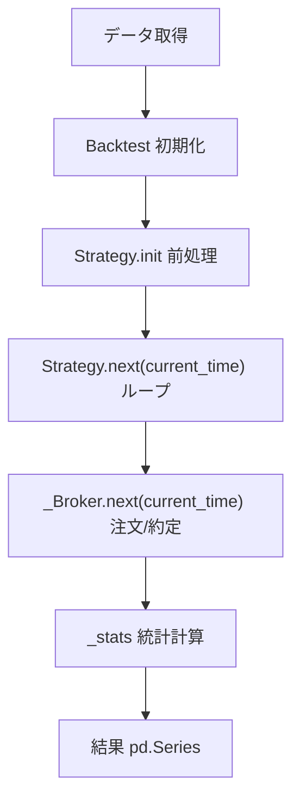

#  BackcastPro ドキュメント

BackcastProは、トレーディング戦略のためのPythonバックテストライブラリです。

## ドキュメント一覧

### ユーザー向けドキュメント

- **[チュートリアル](tutorial.md)** - 基本的な使い方を学ぶ
- **[APIリファレンス](https://botteryosuke.github.io/BackcastPro/namespacesrc_1_1BackcastPro.html)** - クラスとメソッドの詳細
- **[トラブルシューティング](troubleshooting.md)** - よくある問題と解決方法

### 開発者向けドキュメント

- **[開発者ガイド](developer-guide.md)** - 開発に参加するための情報
- **[約定ロジック分析レポート](execution-logic-report.md)** - 売買約定時の価格決定ロジック詳細
- **[PyPIへのデプロイ方法](how-to-deploy-to-PyPI.md)** - パッケージの配布方法

### サンプルコード

- **[サンプル集](examples/)** - 実用的な戦略の例
  - [クイックスタートガイド](examples/QuickStartUserGuide.py)
  - [SMAクロス戦略](examples/SmaCross.py)
  - [Streamlitアプリ](examples/Streamlit.py)

## クイックスタート

```python
import pandas_datareader.data as web
from BackcastPro import Strategy, Backtest

# シンプルな買い持ち戦略
class BuyAndHold(Strategy):
    def init(self):
        pass
    
    def next(self, current_time):
        for code, df in self.data.items():
            if len(df) == 1:
                self.buy(code=code)

# データを取得してバックテストを実行
code='7203.JP' # トヨタ
df = web.DataReader(code, 'stooq')
bt = Backtest({code: df}, BuyAndHold, cash=10000)
results = bt.run()
print(results)
```

## 主な機能

- **シンプルな戦略実装**: `Strategy` を継承して `init` と `next` を実装
- **統計の自動計算**: 代表的なパフォーマンス指標を同梱
- **リスク管理**: `sl` と `tp` に標準対応
- **可視化**: Streamlit 連携の例を提供



## サポート

- **GitHub Issues**: バグ報告や機能要求
- **Discord**: コミュニティでの質問
- **ドキュメント**: 詳細な使用方法の確認

## ライセンス

MIT License - 詳細は[LICENSE](../LICENSE)を参照してください。
