#  チュートリアル

BackcastProを使ったバックテストの基本的な使い方を学びます。

## 目次

1. [インストール](#インストール)
2. [基本的な使い方](#基本的な使い方)
3. [最初の戦略](#最初の戦略)
4. [データの取得](#データの取得)
5. [バックテストの実行](#バックテストの実行)
6. [リプレイ型シミュレーター](#リプレイ型シミュレーター)
7. [結果の解釈](#結果の解釈)
8. [marimo連携](#marimo連携)
9. [次のステップ](#次のステップ)

## インストール（Windows）

```powershell
python -m pip install BackcastPro
```

## 基本的な使い方

BackcastProは**リプレイ型シミュレーター**です。1バーずつ時間を進めながら、戦略を実行してチャートと売買を可視化できます。

```mermaid
sequenceDiagram
    participant U as User
    participant D as DataReader
    participant B as Backtest
    participant S as Strategy Function
    participant R as Results
    U->>D: yf.download('7203.T', period='1y')
    D-->>U: OHLCV DataFrame
    U->>B: Backtest(data={code: df})
    loop 各タイムスタンプ
        U->>S: my_strategy(bt)
        S->>B: buy()/sell()
        U->>B: step()
    end
    U->>B: finalize()
    B-->>R: pd.Series（統計含む）
```



### 1. 必要なライブラリのインポート

```python
from BackcastPro import Backtest
import pandas as pd
```

### 2. データの準備

```python
import yfinance as yf

# トヨタの株価データを取得
code = '7203.T'  # 東証の銘柄コード
df = yf.download(code, period='1y')
print(df.head())
```

## 最初の戦略

### シンプルな買い持ち戦略

最初に、一度だけ買う「買い持ち」戦略を作成してみましょう：

```python
def buy_and_hold(bt):
    """最初のバーで一度だけ買う"""
    if bt.position == 0:
        bt.buy(tag="initial_buy")
```

### バックテストの実行

```python
# バックテストを初期化
bt = Backtest(data={code: df}, cash=10000, commission=0.001)

# 一括実行
bt.set_strategy(buy_and_hold)
results = bt.run()
print(results)
```

## データの取得

### 日本株データの取得

```python
import yfinance as yf

# 特定の銘柄のデータを取得
toyota_data = yf.download('7203.T', period='1y')  # トヨタ
sony_data = yf.download('6758.T', period='1y')    # ソニー

# 期間を指定してデータを取得
from datetime import datetime, timedelta

end_date = datetime.now()
start_date = end_date - timedelta(days=365)  # 1年前

data = yf.download('7203.T', start=start_date, end=end_date)
```

> [!NOTE]
> BackcastProは、ローカルキャッシュにデータが存在しない場合、自動的にGoogle Driveからデータをダウンロードします。
> これにより、手動でのデータ準備なしにバックテストを開始できる場合があります。

### カスタムデータの使用

```python
import pandas as pd

# カスタムデータを作成
custom_data = pd.DataFrame({
    'Open': [100, 101, 102, 103, 104],
    'High': [105, 106, 107, 108, 109],
    'Low': [99, 100, 101, 102, 103],
    'Close': [104, 105, 106, 107, 108],
    'Volume': [1000, 1100, 1200, 1300, 1400]
}, index=pd.date_range('2023-01-01', periods=5))

# バックテストで使用
bt = Backtest(data={'CUSTOM': custom_data}, cash=10000)
bt.set_strategy(buy_and_hold)
results = bt.run()
```

### 複数銘柄の同時バックテスト

```python
# 複数の銘柄データを取得
toyota_data = yf.download('7203.T', period='1y')
sony_data = yf.download('6758.T', period='1y')

# 複数銘柄でバックテストを初期化
bt = Backtest(
    data={
        '7203.T': toyota_data,
        '6758.T': sony_data
    },
    cash=10000
)

# 複数銘柄対応の戦略
def multi_stock_strategy(bt):
    for code in bt.data.keys():
        pos = bt.position_of(code)  # ⚠️ 複数銘柄時は position_of を使用
        if pos == 0:
            bt.buy(code=code, tag="buy")

bt.set_strategy(multi_stock_strategy)
results = bt.run()
```

## バックテストの実行

### 方法1: 一括実行（推奨）

```python
bt = Backtest(
    data={code: df},
    cash=10000,
    commission=0.001,
    finalize_trades=True,
)
bt.set_strategy(my_strategy)
results = bt.run()
```

### 方法2: ステップ実行

```python
bt = Backtest(data={code: df}, cash=10000)

while not bt.is_finished:
    my_strategy(bt)
    bt.step()

results = bt.finalize()
```

## リプレイ型シミュレーター

BackcastProの特徴は、**1バーずつ時間を進めながら可視化**できることです。

### ステップ実行の基本

```python
bt = Backtest(data={code: df}, cash=10000)

# 10バー進める
for _ in range(10):
    my_strategy(bt)
    bt.step()

    # 現在の状態を確認
    print(f"時間: {bt.current_time}")
    print(f"進捗: {bt.progress * 100:.1f}%")
    print(f"資産: ${bt.equity:,.2f}")
    print(f"ポジション: {bt.position}")
    print("---")
```

### goto() で任意の位置へジャンプ

```python
# 100バー目まで進める（戦略を適用しながら）
bt.goto(100, strategy=my_strategy)

# 状態を確認
print(f"時間: {bt.current_time}")
print(f"資産: {bt.equity:,.0f}")
print(f"ポジション: {bt.position}")
```

### reset() で最初からやり直し

```python
bt.reset()
# 再度実行可能
```

## 結果の解釈

### 基本的な統計情報

```python
results = bt.finalize()

# 主要な統計情報を表示
print(f"総リターン: {results['Return [%]']:.2f}%")
print(f"年率リターン: {results['Return (Ann.) [%]']:.2f}%")
print(f"シャープレシオ: {results['Sharpe Ratio']:.2f}")
print(f"最大ドローダウン: {results['Max. Drawdown [%]']:.2f}%")
print(f"取引回数: {results['# Trades']}")
print(f"勝率: {results['Win Rate [%]']:.2f}%")
```

### エクイティカーブの確認

```python
# エクイティカーブを取得
equity_curve = results['_equity_curve']
print(equity_curve.head())

# ドローダウンを確認
drawdown = equity_curve['DrawdownPct']
print(f"最大ドローダウン: {drawdown.min():.2f}%")
```

### トレード履歴の確認

```python
# トレード履歴を取得
trades = results['_trades']
print(trades.head())

# 勝ちトレードと負けトレードを分析
winning_trades = trades[trades['PnL'] > 0]
losing_trades = trades[trades['PnL'] < 0]

print(f"勝ちトレード数: {len(winning_trades)}")
print(f"負けトレード数: {len(losing_trades)}")
```

## marimo連携

marimoと連携して、スライダーで時間を操作しながらリアルタイムで可視化できます。

### 基本的なmarimo連携

```python
import marimo as mo
from BackcastPro import Backtest

# データ準備
bt = Backtest(data={"AAPL": df_aapl}, cash=100000)

# 戦略定義
def my_strategy(bt):
    df = bt.data.get("AAPL")
    if df is None or len(df) < 2:
        return

    c0 = df["Close"].iloc[-2]
    c1 = df["Close"].iloc[-1]

    if bt.position == 0 and c1 < c0:
        bt.buy(tag="dip_buy")
    elif bt.position > 0 and c1 > c0:
        bt.sell(tag="profit_take")
```

### UIコントロール

```python
# 時間スライダー
slider = mo.ui.slider(
    start=1,
    stop=len(bt.index),
    value=1,
    label="📅 時間",
    show_value=True
)

# スライダー位置まで進める
bt.goto(slider.value, strategy=my_strategy)

# 情報パネル
state = bt.get_state_snapshot()
info = mo.md(f"""
### 状況
| 項目 | 値 |
|------|-----|
| 日時 | {state['current_time']} |
| 進捗 | {state['progress'] * 100:.1f}% |
| 資産 | ¥{state['equity']:,.0f} |
| 現金 | ¥{state['cash']:,.0f} |
| 決済済取引 | {state['closed_trades']} 件 |
""")

mo.vstack([slider, info])
```

## インジケーターの活用

データにインジケーター列を追加し、戦略内で参照できます。

```python
# データにインジケーターを追加
df['SMA_20'] = df['Close'].rolling(20).mean()
df['SMA_50'] = df['Close'].rolling(50).mean()

bt = Backtest(data={code: df}, cash=10000)

# 戦略内でインジケーターを参照
def sma_cross_strategy(bt):
    for code, df in bt.data.items():
        if len(df) < 50:
            continue

        sma20 = df['SMA_20'].iloc[-1]
        sma50 = df['SMA_50'].iloc[-1]

        if bt.position_of(code) == 0 and sma20 > sma50:
            bt.buy(code=code, tag="golden_cross")
        elif bt.position_of(code) > 0 and sma20 < sma50:
            bt.sell(code=code, tag="dead_cross")

bt.set_strategy(sma_cross_strategy)
results = bt.run()
```

## 次のステップ

### 1. より複雑な戦略の実装

```python
def moving_average_cross(bt):
    """移動平均クロス戦略"""
    df = bt.data.get("AAPL")
    if df is None or len(df) < 20:
        return

    sma_short = df["Close"].rolling(10).mean().iloc[-1]
    sma_long = df["Close"].rolling(20).mean().iloc[-1]
    sma_short_prev = df["Close"].rolling(10).mean().iloc[-2]
    sma_long_prev = df["Close"].rolling(20).mean().iloc[-2]

    # ゴールデンクロスで買い
    if bt.position == 0 and sma_short > sma_long and sma_short_prev <= sma_long_prev:
        bt.buy(tag="golden_cross")

    # デッドクロスで売り
    elif bt.position > 0 and sma_short < sma_long and sma_short_prev >= sma_long_prev:
        bt.sell(tag="dead_cross")
```

### 2. リスク管理の追加

```python
def strategy_with_risk_management(bt):
    if bt.position == 0:
        price = bt.data["AAPL"]["Close"].iloc[-1]
        bt.buy(
            sl=price * 0.95,  # 5%下落でストップロス
            tp=price * 1.10,  # 10%上昇でテイクプロフィット
            tag="entry_with_sl_tp"
        )
```

### 3. パフォーマンスの可視化

```python
import matplotlib.pyplot as plt

# エクイティカーブをプロット
equity_curve = results['_equity_curve']
plt.figure(figsize=(12, 6))

plt.subplot(2, 1, 1)
plt.plot(equity_curve.index, equity_curve['Equity'])
plt.title('エクイティカーブ')
plt.ylabel('資産')

plt.subplot(2, 1, 2)
plt.plot(equity_curve.index, equity_curve['DrawdownPct'])
plt.title('ドローダウン')
plt.ylabel('ドローダウン (%)')

plt.tight_layout()
plt.show()
```

## よくある質問

### Q: データが取得できない場合はどうすればいいですか？

A: 以下の点を確認してください：
1. インターネット接続
2. 銘柄コードの正確性
3. 日付範囲の妥当性

### Q: バックテストが遅い場合はどうすればいいですか？

A: 以下の方法を試してください：
1. データ期間を短くする
2. 複雑な計算を事前に行っておく
3. 不要なデータを削除する

### Q: 複数銘柄で position がおかしい

A: 複数銘柄を扱う場合は `bt.position` ではなく `bt.position_of(code)` を使用してください。
`position` は全銘柄合計のため、個別銘柄のポジションを正確に取得できません。

### Q: size を省略した時の動作は？

A: 反対ポジションがある場合は全クローズ、ない場合は全力で新規ポジションを取ります。

| 条件 | 動作 |
|------|------|
| `bt.sell()` でロング保有中 | 全ロングをクローズ |
| `bt.buy()` でショート保有中 | 全ショートをクローズ |
| ポジションなし | 全資産で新規ポジション |
| 同方向ポジション保有中 | `margin_available` で買い増し |

明示的にサイズを指定したい場合は `bt.buy(size=100)` のように指定してください。

## まとめ

- **データ準備** → **Backtest初期化** → **戦略関数定義** → **実行** → **分析** の順に進めます
- `set_strategy()` + `run()` で一括実行、または `step()` でステップ実行
- marimo連携でインタラクティブなリプレイシミュレーションが可能
